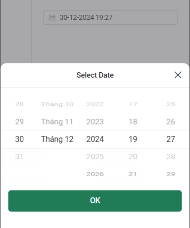

## Getting Started

A ios Date picker for website in vue 3



## Features

- Single date picker
- Time picker
- Month picker
- Year picker
- Quarter picker
- Week picker
- Custom `v-model`
- SSR support
- Highly configurable
- Accessible
- Included type definitions

### Installation

```console
# npm
npm install vue3-ios-datepicker

# yarn
yarn add vue3-ios-datepicker

# pnpm
pnpm add vue3-ios-datepicker

# bun
bun add vue3-ios-datepicker
```

### How to use

```vue
<template>
  <Vue3IosDatepicker v-model="value" />
</template>

<script setup lang="ts">
import { Vue3IosDatepicker } from "vue3-ios-datepicker"; // import component
const value = ref<Date>(new Date());
</script>
```

## Props and attributes

| ID             | Type                                | Default        | Description                                                                                           |
| -------------- | ----------------------------------- | -------------- | ----------------------------------------------------------------------------------------------------- |
| `placeholder`  | `String`                            | `Select date`  | Placeholder of native input                                                                           |
| `id`           | `String`                            |                | Id of native input                                                                                    |
| `name`         | `String`                            |                | Name of native input                                                                                  |
| `format`       | `String`                            | `YYYY-MM-DD`   | Format of the displayed value in the input box                                                        |
| `iconClose`    | `String`                            |                | Custom close icon in bottom sheet of calendar                                                         |
| `class`        | `String`                            |                | Custom class container                                                                                |
| `inputClass`   | `String`                            |                | Custom class native input                                                                             |
| `title`        | `String`                            | `Select Date`  | Custom title in bottom sheet of calendar                                                              |
| `defaultValue` | `Date`                              |                | Optional, default date of the calendar                                                                |
| `confirmLabel` | `String`                            | `OK`           | Text of confirm button in bottom sheet of calendar                                                    |
| `icon`         | `String`                            | `CalendarIcon` | Custom calendar icon                                                                                  |
| `disabledDate` | `Function: (data: Date) => boolean` |                | a function determining if a date is disabled with that date as its parameter. Should return a Boolean |
| `options`      | `Object`                            |                | See in below                                                                                          |
| `lang`         | `String`                            | `en`           | language                                                                                              |
| `locale`       | `Object`                            |                | Locale Object                                                                                         |

## Options

| ID        | Type   | Default | Description                                           |
| --------- | ------ | ------- | ----------------------------------------------------- |
| `minDate` | `Date` |         | disable confirm button if value less than minDate     |
| `maxDate` | `Date` |         | disable confirm button if value greather than maxDate |

## Events

- `onChange`: Emitted value when click confirm button
